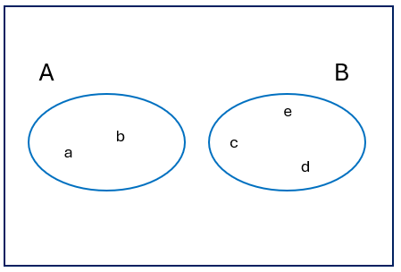

---
tags:
- Kombinatorik
- Sandsynlighed
- Multiplikationsreglen
- Permutationer
- Kombinationer
- Med erstatning
- Uden erstatning
- Prøverum
- Sandsynlighed for hændelser
- Komplementer
- Forening
- Betinget sandsynlighed
- Poker hænder
- Adgangskoder
---

<h1 align="center">Øvelser 1: Kombinatorik og sandsynlighedsteori</h1>

I skal lave øvelserne inden timerne torsdag. I kan med fordel lave dem i grupper og diskutere dem indbyrdes. Det er vigtigt, at I forstår opgaverne og kan forklare dem til hinanden. På torsdag diskuterer vi opgaverne, og I skal være klar til at præsentere dem for klassen. I vil opleve at fra denne session bliver mængden af øvelse mere omfattende og komplekse.

### Repetitionsøvelser

#### Repetitionsøvelse 1: Er dette en mængde?

Hvilke af følgende er mængder?

1. $\{3\}$ (1)
{ .annotate }

    1. Ja

2. $\{3,5,1,03\}$ (1)
{ .annotate }

    1. Ja

3. $\{\text{NULL}, \text{apple}, 5, B\}$ (1)
{ .annotate }

    1. Ja

4. $\{1,2,\text{NULL},4,5,\text{NULL},3\}$ (1)
{ .annotate }

    1. Nej, dubletter

5. $\{\text{David}, \text{Roger}, \text{Nik}, \text{Richard}\}$ (1)
{ .annotate }

    1. Ja

6. $\{\text{Michael}, \text{John}, \text{Terry}, \text{Eric}, \text{Graham}, \text{Terry}\}$ (1)
{ .annotate }

    1. Nej, dubletter

#### Repetitionsøvelse 2: Dual Isomorfi

Vis at $(A \cup B)\setminus B = A \setminus B$ ved hjælp af en sandhedstabel.

??? answer "&nbsp;"

    | A | B | B$^c$ | A ∪ B | (A ∪ B) ∧ B$^c$ | A ∧ B$^c$ |
    |:-:|:-:|:----:|:----:|:--------------:|:---------:|
    | 0 | 0 | 1    | 0    | 0              | 0         |
    | 0 | 1 | 0    | 1    | 0              | 0         |
    | 1 | 0 | 1    | 1    | 1              | 1         |
    | 1 | 1 | 0    | 1    | 0              | 0         |

    Kolonnerne for $(A \cup B)\cap B^c$ og $A\cap B^c$ er identiske.

#### Repetitionsøvelse 3: Mængdeidentiteter

Vis at $(A \oplus B)\cap A = A \setminus B$ ved hjælp af mængdeidentiteter.

??? answer "&nbsp;"

    \[
    (A \oplus B) \cap A
    = [(A \cap B^c) \cup (A^c \cap B)] \cap A
    = (A \cap B^c) \cup \varnothing
    = A \cap B^c
    = A \setminus B
    \]

#### Repetitionsøvelse 4: Antal elementer

Mængden $A$ har $100$ elementer, mængden $B$ har $50$ elementer. Hvis $A \cap B$ har $25$ elementer, hvor mange elementer har $A \cup B$?

??? answer "&nbsp;"  

    $|A \cup B| = |A| + |B| - |A \cap B| = 100 + 50 - 25 = 125$

### Almindelige øvelser

#### Øvelse 1: Kombinatorik og Sandsynlighed

En bestilling af en personlig digital assistent kan specificere en af fem hukommelsesstørrelser, en af tre typer skærme, en af fire harddiskstørrelser og kan enten inkludere eller ikke inkludere en pen-tablet. Hvor mange forskellige systemer kan bestilles? Angiv hvilken regel/teorem fra bogen du bruger.

??? answer "&nbsp;"

    $5 \cdot 3 \cdot 4 \cdot 2 = 120$ (Multiplikationsregel)

#### Øvelse 2: Garageporte og indbrudstyve
En trådløs garageportåbner har en kode bestemt af op/ned-indstillingen af 12 kontakter.

1. Hvor mange mulige koder findes der?

    ??? answer "&nbsp;"

        $2^{12} = 4096$

2. Hvad er sandsynligheden for at en indbrudstyv gætter den rigtige kode i første forsøg?

    ??? answer "&nbsp;"

        $\frac{1}{4096} = 0.000244 = 0.0244\%$

#### Øvelse 3: Kombinatorik og Sandsynlighed

En gruppe på 3 børn skal dannes i en klasse på 15 børn.

1. Hvor mange forskellige måder kan du danne gruppen hvis rækkefølgen af børnene ikke betyder noget?

    ??? answer "&nbsp;"

        $\binom{15}{3} = 455$

2. Hvor mange forskellige måder kan du danne gruppen hvis rækkefølgen betyder noget?

    ??? answer "&nbsp;"

        $P(15,3)=\frac{15!}{12!}=2730$

3. Hvad er sandsynligheden for at gruppen består af de tre børn Xavier, Ygritte og Zelda?

    ??? answer "&nbsp;"

        $\frac{1}{455}=\frac{6}{2730}=0.00220 = 0.220\%$

#### Øvelse 4: Pokerhænder

På hvor mange måder kan man give en pokerhånd på fem kort fra et standarddæk på 52 kort?  
Og hvor mange måder er der at vælge 47 kort fra et standarddæk på 52 kort?

??? answer "&nbsp;"

    $\binom{52}{5}=2,598,960$  
    $\binom{52}{47}=2,598,960$

#### Øvelse 5: Garageporte og indbrudstyve igen

Husk garageportene fra Øvelse 2. Hvad er sandsynligheden for at en indbrudstyv gætter den rigtige kode i 3 forsøg, forudsat at gæt sker med tilbagelægning?

??? answer "&nbsp;"

    $1-\left(\frac{4095}{4096}\right)^3 \approx 0.00073$

#### Øvelse 6: Webside-adgangskoder

En webside kræver at brugeren laver en adgangskode der indeholder præcis 4 tegn.

Lad $A$ betegne mængden af adgangskoder der kun indeholder bogstaver (26 små bogstaver, a-z, og 26 store bogstaver, A-Z).

Lad $B$ betegne mængden af adgangskoder der kun indeholder tal (0-9).

Lad $C$ betegne mængden af adgangskoder der kan indeholde både bogstaver og tal. En hacker prøver at gætte en bestemt brugers adgangskode.

Hvad er sandsynligheden for at han gætter den korrekte kode i første forsøg i hvert af tilfældene nedenfor?

1. Hvis kun $A$ er tilladt:

    ??? answer "&nbsp;"

        $\frac{1}{52^4}= \frac{1}{7,311,616}$

2. Hvis kun $B$ er tilladt:

    ??? answer "&nbsp;"

        $\frac{1}{10^4}= \frac{1}{10,000}$

3. Hvis kun $A \cup B$ er tilladt:

    ??? answer "&nbsp;"

        $\frac{1}{52^4+10^4}= \frac{1}{7,321,616}$

4. Hvis $C$ er tilladt:

    ??? answer "&nbsp;"

        $\frac{1}{62^4}= \frac{1}{14,776,336}$

#### Øvelse 7: Sandsynligheder

De mulige fem udfald af et tilfældigt forsøg er lige sandsynlige. Udfaldsrummet er $\{a,b,c,d,e\}$. Lad $A=\{a,b\}$ og $B=\{c,d,e\}$.

1. Tegn et Venn-diagram der viser udfaldsrummet og hver af hændelserne $A$ og $B$.

    ??? answer "&nbsp;"

        {width="300"}

2. Bestem hver af de følgende sandsynligheder:

    $P(A)$

    ??? answer "&nbsp;"

        $P(A)=\frac{2}{5}$

    $P(B)$

    ??? answer "&nbsp;"

        $P(B)=\frac{3}{5}$

    $P(\overline{A})$

    ??? answer "&nbsp;"

        $P(\overline{A})=\frac{3}{5}$

    $P(A \cup B)$

    ??? answer "&nbsp;"

        $P(A \cup B)=1$

    $P(A \cap B)$

    ??? answer "&nbsp;"

        $P(A \cap B)=0$

### Udfordringsøvelser

#### Udfordringsøvelse 1: Adgangskoder

En computeradgangskode består af 4 tegn, hvert ét af 26 små bogstaver, 26 store bogstaver eller et tal mellem 0 og 9. Hvis koden skal indeholde mindst ét bogstav og mindst ét tal, hvor mange forskellige adgangskoder er mulige?

??? answer "&nbsp;"

    Den letteste måde at beregne dette er først at beregne antallet af 4-tegns koder og derefter trække dem fra, der ikke opfylder reglen, dvs. dem der kun indeholder bogstaver eller kun tal: $62^4-52^4-10^4=7,454,720$

#### Udfordringsøvelse 2: Kuponindsamler-problem

Du trækker gentagne gange et kort tilfældigt fra et standarddæk på 52 kort, med tilbagelægning.

Hvad er det forventede antal træk indtil du har set alle 52 forskellige kort mindst én gang?

??? answer "&nbsp;"

    Den forventede værdi er $52 \cdot H_{52}$, hvor $H_{n}$ er det $n$-te harmoniske tal.
    $H_{52} \approx \ln(52)+\gamma+ \tfrac{1}{2\cdot 52} \approx 4.518$.
    Resultat: $\approx 52 \cdot 4.518 = 235$ træk.

#### Udfordringsøvelse 3: Generaliseret fødselsdagsproblem

Hvor mange personer skal være i et rum, så sandsynligheden for at **mindst tre** har samme fødselsdag overstiger $0.5$ (antag 365 lige sandsynlige fødselsdage, ignorer skudår)?

??? answer "&nbsp;"

    Brug Poisson-approksimation: forventet antal tripler $\approx \frac{n^3}{6\cdot 365^2}$.
    Løs $\frac{n^3}{6\cdot 365^2} \approx \ln 2 \approx 0.693$.
    $n \approx (0.693 \cdot 6 \cdot 365^2)^{1/3} \approx 88$.
    Så ca. **88 personer** er nødvendige.

#### Udfordringsøvelse 4: Betinget sandsynlighed med urner

En urne indeholder 5 røde kugler og 7 blå kugler. Du trækker to kugler uden tilbagelægning.

1. Hvad er sandsynligheden for at de to kugler har samme farve?

    ??? answer "&nbsp;"

        $P(\text{samme})=\frac{\binom{5}{2}+\binom{7}{2}}{\binom{12}{2}}=\frac{10+21}{66}=\frac{31}{66}\approx 0.47$

2. Antag at du trækker én kugle (uden at afsløre farven), lægger den tilbage, og trækker så igen. Hvad er sandsynligheden for at begge har samme farve?

    ??? answer "&nbsp;"

        Med tilbagelægning: $P(\text{samme})=\left(\tfrac{5}{12}\right)^2+\left(\tfrac{7}{12}\right)^2=\tfrac{25+49}{144}=\tfrac{74}{144}=\tfrac{37}{72}\approx 0.51$

3. Forklar forskellen mellem de to scenarier.

    ??? answer "&nbsp;"

        Uden tilbagelægning opstår afhængighed (færre kugler tilbage), hvilket sænker chancen for et match. Med tilbagelægning er træk uafhængige, hvilket giver en lidt højere sandsynlighed.