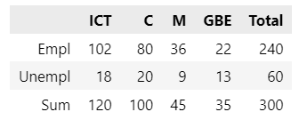

<h1 align="center">Øvelser 1: Betingede sandsynligheder og Bayes' teorem</h1>

I skal lave øvelserne inden timerne torsdag. I kan med fordel lave dem i grupper og diskutere dem indbyrdes. Det er vigtigt, at I forstår opgaverne og kan forklare dem til hinanden. På torsdag diskuterer vi opgaverne, og I skal være klar til at præsentere dem for klassen.

#### Øvelse 1: Repetition

Lad $A$ og $B$ være to hændelser sådan at:

$$
P(A)=0.3, \quad P(B)=0.2, \quad P(A \cap B)=0.1
$$

Find sandsynlighederne nedenfor. Angiv dine svar korrekte til én decimal.

a. Find $P(A^c)$. (1)
{ .annotate }

1. $P(A^c)=0.7$.

b. Find $P\left(A \cup B\right)$. (1)
{ .annotate }

1. $P\left(A \cup B\right)=0.4$.

c. Find $P\left(A^c \cap B\right)$. (1)
{ .annotate }

1. $P\left(A^c \cap B\right)=0.1$

d. Find $P\left(A \cap B^c\right)$. (1)
{ .annotate }

1. $P\left(A \cap B^c\right)=0.2$.

e. Find $P\left((A \cup B)^c\right)$. (1)
{ .annotate }

1. $P\left((A \cup B)^c\right)=0.6$.

f. Find $P\left(A^c \cup B\right)$. (1)
{ .annotate }

1. $P\left(A^c \cup B\right)=0.8$.

#### Øvelse 2: Kaster med ærlig terning

Jeg kaster en ærlig terning to gange og får to tal: $X_1=$ resultatet af første kast, $X_2=$ resultatet af andet kast.

a. Find sandsynligheden for at $X_2=4$. (1)
{ .annotate }

1. $\dfrac{1}{6}$

b. Find sandsynligheden for at $X_1+X_2=7$. (1)
{ .annotate }

1. $\dfrac{1}{6}$

c. Find sandsynligheden for at $X_1 \neq 2$ og $X_2 \geq 4$. (1)
{ .annotate }

1. $\dfrac{5}{12}$

#### Øvelse 3: Venn og sandsynlighed

Lad $A, B$ og $C$ være tre hændelser med sandsynligheder givet:

Find sandsynlighederne nedenfor. Angiv dine svar som uforkortelige brøker.

a. $P(A \mid B)$ (1)
{ .annotate }

1. $\dfrac{4}{7}$

b. $P(C \mid B)$ (1)
{ .annotate }

1. $\dfrac{3}{7}$

c. $P(B \mid A \cup C)$ (1)
{ .annotate }

1. $\dfrac{5}{14}$

d. $P(B \mid (A, C))$ (1)
{ .annotate }

1. $\dfrac{1}{2}$

#### Øvelse 4: Flere fly
Sandsynligheden for at et regelmæssigt planlagt fly afgår til tiden er $0.83$; sandsynligheden for at det ankommer til tiden er $0.82$; og sandsynligheden for at det afgår og ankommer til tiden er $0.78$. Find sandsynligheden for at et fly. Angiv dine svar korrekte til fire decimaler.

a. Ankommer til tiden, givet at det afgik til tiden (1)
{ .annotate }

1. 0.9398

b. Afgik til tiden, givet at det har ankommet til tiden (1)
{ .annotate }

1. 0.9512

c. Ankommer til tiden, givet at det ikke afgik til tiden (1)
{ .annotate }

1. 0.2353

#### Øvelse 5: Uafhængighed og kontingenstabeller
En undersøgelse blev gennemført for at bestemme beskæftigelsesgraden for nyligt dimitterede ingeniørstuderende. Undersøgelsen blev gennemført ét år efter dimission og blev lavet for ICT-ingeniører, Bygningsingeniører, Maskiningeniører og Global Business Engineers. De dimitterede blev klassificeret i en af to beskæftigelseskategorier: (1) beskæftiget/studerende og (2) arbejdsløs. 40% af respondenterne havde studeret ICT-ingeniør og af disse var 85% beskæftiget/studerende. Af alle respondenterne var 20% arbejdsløse. Af de 100 tidligere bygningsingeniørstuderende, der deltog i undersøgelsen, var 20% arbejdsløse. Andelen af arbejdsløse maskin- og bygningsingeniørstuderende var den samme, og undersøgelsen inkluderede præcis 9 arbejdsløse maskiningeniørstuderende. 300 studerende deltog i undersøgelsen.

a. Baseret på disse oplysninger, konstruer en 2 x 4 kontingenstabel for undersøgelsesresultaterne.

??? answer "&nbsp;"
    

    Teknisk set er summerne og totalerne ikke en del af kontingenstabellerne. De tilføjes for at gøre det nemmere at beregne sandsynlighederne.

b. Hvad er sandsynligheden for at en arbejdsløs respondent er en tidligere ICT-studerende? Angiv dit svar som en uforkortelig brøk. (1)
{ .annotate }

1. $\dfrac{3}{10}$

c. Hvis en respondent er arbejdsløs, hvad er sandsynligheden for at respondenten var en GBE-studerende? Angiv dit svar som en uforkortelig brøk. (1)
{ .annotate }

1. $\dfrac{13}{60}$

d. Er det at være arbejdsløs uafhængigt af at være en tidligere ICT-studerende? (1)
{ .annotate }

??? answer "&nbsp;"
    Du kan sammenligne enhver a priori sandsynlighed med den tilsvarende a posteriori sandsynlighed. F.eks. fandt du en a posteriori sandsynlighed på $\dfrac{3}{10}$ i (b). Den a priori sandsynlighed er $\dfrac{2}{5}$. Da de to sandsynligheder ikke er lige store, er de to hændelser afhængige:

    $P(\text{ICT} \mid \text{Arbejdsløs}) = \dfrac{3}{10} \neq \dfrac{2}{5} = P(\text{ICT})$

#### Øvelse 6: Bayes' teorem
Sygdom $A$ forekommer med sandsynlighed 0.1, og sygdom $B$ forekommer med sandsynlighed 0.2. Det er ikke muligt at have begge sygdomme. Du har en enkelt test. Denne test rapporterer positiv med sandsynlighed 0.8 for en patient med sygdom $A$, med sandsynlighed 0.5 for en patient med sygdom $B$, og med sandsynlighed 0.01 for en patient uden sygdom - kald sidstnævnte hændelse $W$. Ved at angive dit svar korrekt til fire decimaler, hvis testen kommer tilbage positiv, hvad er sandsynligheden for at du har enten:

a. Sygdom $A$

b. Sygdom $B$ eller

c. Ingen sygdom

Bemærk: Du skal beregne tre sandsynligheder; én for hver af de tre hændelser angivet i a-c.

??? answer "&nbsp;"
    a. Sygdom $A$: 0.4278

    b. Sygdom $B$: 0.5348

    c. Ingen sygdom: 0.0374

#### Øvelse 7: Udfordringsøvelse
Brug kun tid på denne øvelse, hvis du har tid tilbage efter at have fuldført de andre øvelser, og du fandt dem for nemme. Problemet er taget fra eksamen i Stokastisk Modellering og Processer (IT-SMP1) på 6./7. semester.

Du vælger et punkt $(A, B)$ ensartet tilfældigt i enhedskvadraten $\{(x, y): 0 \leq x, y \leq 1\}$.

    

Hvad er sandsynligheden for at ligningen

$$
A X^2+X+B=0
$$

har reelle løsninger?

[solution](Solution7.pdf)
