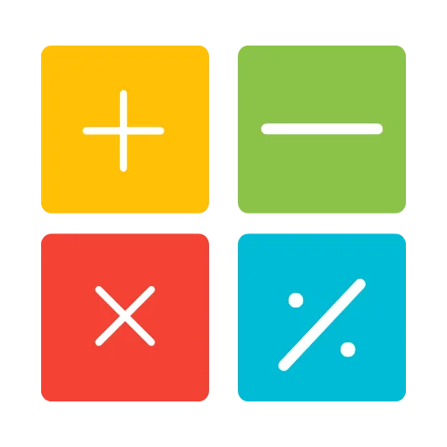

---
tags:
    - Betingede sandsynligheder
    - Bayes' Teorem
    - Uafhængighed
    - Total sandsynlighed
    - Bayes' regel
    - A priori sandsynlighed
    - A posteriori sandsynlighed
    - Betingede hændelser
---

<h1 align="center">Betingede sandsynligheder og Bayes' Teorem</h1>

I denne session bygger vi videre på vores introduktion til sandsynlighed, dykker ned i emnet ved at udforske begreberne afhængige og uafhængige hændelser. Vi vil diskutere hvordan forekomsten af én hændelse kan påvirke sandsynligheden for en anden. Betinget sandsynlighed vil blive introduceret, hvor vi fremhæver hvordan sandsynligheder ændrer sig når yderligere information er kendt. Vi vil også dække sandsynligheden for snit mellem hændelser, hvilket hjælper med at forstå overlappende forekomster. Kontingenstabeller vil blive brugt til at organisere data og beregne sandsynligheder effektivt, og vi vil afslutte med Bayes' teorem, et kraftfuldt værktøj til at opdatere sandsynligheder baseret på nye beviser.

- {align=right : style="height:100px;width:150px"}
    
    **M1:** Her finder du læsemateriale, videoer og quizzer, der hjælper dig med at forberede dig til den første undervisning. Det er vigtigt at man som minimum har set videoerne.

    [:octicons-arrow-right-24: M1: Forberedelse](M1.md)

- {align=right : style="height:100px;width:150px"}

    **M2:** Her finder du de eksempler som jeg gennemgår til den første undervisningsgang og efterfølgende lægger jeg videoen op her også. Det er vigtigt at I har set videoerne fra M1 inden.
    
    [:octicons-arrow-right-24: M2: Undervisning 1](M2.md)

- {align=right : style="height:150px;width:150px"}

    **M3:** Her finder du de øvelser, som I skal lave enten selv eller i grupper. Der er også en række tutorials, der viser hvordan man kan gribe opgaverne an.

    [:octicons-arrow-right-24: M3: Øvelser](M3/index.md)

- {align=right : style="height:100px;width:150px"}

    **M4:** Her finder du materiale fra anden undervisnings-gang, herunder mine løsninger, og efterfølgende lægger jeg videoen op her også.
    
    [:octicons-arrow-right-24: M4: Undervisning 2](M4.md)

