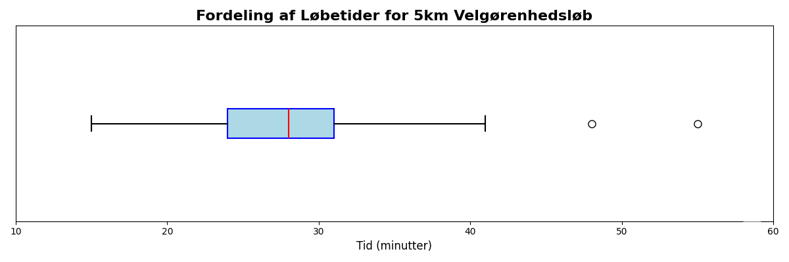

<h1 align="center">M2: Undervisning 1 - gennemgang af eksempler</h1>

Til undervisningen gennemgår jeg eksempler, der understøtter og eksemplificerer de emner, vi har dækket i videoerne. Det er vigtigt at forstå, hvordan disse koncepter anvendes i praksis, og hvordan de kan hjælpe dig med at løse problemer inden for softwareudvikling. Denne session foregår synkront på Teams og I kan under undervisningen stille spørgsmål og deltage aktivt i diskussionen. Det er en god mulighed for at få afklaret eventuelle tvivlsspørgsmål og få en dybere forståelse af emnerne. Videoen lægges op efterfølgende, så du kan se den igen, hvis du ønsker det.

## Eksempler

Det er ikke et krav, at I har kigget på eksemplerne før undervisningen, men det kan være en fordel. I vil også kunne finde videoen fra undervisningen nedenfor, når den er klar. Jeg gennemgår følgende eksempler.

[Eksempler fra undervisning 1](https://drive.google.com/file/d/16NpLc32HbCW129bQw9zZGJQqJ7LKbI6P/view?usp=sharing)

#### Eksempel 1: Datatyper og grundlæggende begreber

Klassificér følgende som kvalitativ eller kvantitativ data. Hvis kvantitativ, angiv om det er diskret eller kontinuert:

1. Antal kodelinjer i en funktion
2. CPU-temperatur i grader Celsius
3. Prioritet på en bug (lav, medium, høj, kritisk)
4. Hukommelsesforbrug i MB
5. Programmeringssprog brugt i et projekt

    ??? answer "&nbsp;"

        1. Kvantitativ, diskret
        2. Kvantitativ, kontinuert
        3. Kvalitativ
        4. Kvantitativ, kontinuert
        5. Kvalitativ

#### Eksempel 2: Centrale målinger

Følgende datasæt viser responstider (i millisekunder) for 15 API-kald:

{120, 135, 140, 145, 150, 155, 160, 165, 170, 175, 180, 185, 190, 195, 350}

1. Beregn middelværdien
2. Beregn medianen
3. Beregn typetallet
4. Hvilken af disse målinger påvirkes mest af den høje værdi (350 ms)?

    ??? answer "&nbsp;"

        1. Middelværdi: $\bar{x} = \frac{2510}{15} = 167.33$ ms
        2. Median: 165 ms (8. værdi når datasættet er sorteret)
        3. Typetal: Ingen (alle værdier forekommer kun én gang)
        4. Middelværdien påvirkes mest af outlieren (350 ms). Uden outlieren ville middelværdien være ca. 160 ms.

#### Eksempel 3: Spredning og variabilitet

For det samme datasæt som i Eksempel 2:

{120, 135, 140, 145, 150, 155, 160, 165, 170, 175, 180, 185, 190, 195, 350}

1. Beregn variationsbredden
2. Beregn første kvartil (Q1) og tredje kvartil (Q3)
3. Beregn interkvartilbredden (IQR)
4. Er der outliers ifølge 1.5 × IQR-reglen?

    ??? answer "&nbsp;"

        1. Variationsbredde = 350 - 120 = 230 ms
        2. Q1 = 145 ms (25%-percentil), Q3 = 185 ms (75%-percentil)
        3. IQR = 185 - 145 = 40 ms
        4. Nedre grænse: Q1 - 1.5 × IQR = 145 - 60 = 85 ms
           Øvre grænse: Q3 + 1.5 × IQR = 185 + 60 = 245 ms
           Ja, 350 ms er en outlier (> 245 ms)

#### Eksempel 4: Frekvensfordeling

En softwaretest registrerede antal fejl fundet pr. dag i løbet af 20 dage:

{2, 3, 2, 5, 3, 2, 4, 3, 2, 6, 3, 2, 4, 3, 5, 2, 3, 4, 2, 3}

1. Lav en frekvenstabel
2. Hvad er typetallet?
3. Beregn den relative frekvens for hver værdi

    ??? answer "&nbsp;"

        1. Frekvenstabel:
        
            | Antal fejl | Frekvens |
            |------------|----------|
            | 2          | 7        |
            | 3          | 7        |
            | 4          | 3        |
            | 5          | 2        |
            | 6          | 1        |

        2. Typetal: 2 og 3 (begge forekommer 7 gange - bimodal fordeling)

        3. Relative frekvenser:
        
            | Antal fejl | Relativ frekvens |
            |------------|------------------|
            | 2          | 7/20 = 0.35      |
            | 3          | 7/20 = 0.35      |
            | 4          | 3/20 = 0.15      |
            | 5          | 2/20 = 0.10      |
            | 6          | 1/20 = 0.05      |

#### Eksempel 6: Empirisk regel og normalfordeling

Et system logger responstider med middelværdi = 200 ms og standardafvigelse = 30 ms. Antag at dataene er cirka normalfordelte.

1. Inden for hvilket interval ligger cirka 68.3% af responstiderne?
2. Inden for hvilket interval ligger cirka 95.4% af responstiderne?
3. Hvis en responstid er 290 ms, hvor mange standardafvigelser er det fra middelværdien?
4. Er en responstid på 290 ms usædvanlig ifølge den empiriske regel?

    ??? answer "&nbsp;"

        1. Cirka 68.3% ligger inden for $\bar{x} \pm s$: [200 - 30, 200 + 30] = [170, 230] ms

        2. Cirka 95.4% ligger inden for $\bar{x} \pm 2s$: [200 - 60, 200 + 60] = [140, 260] ms

        3. $z = \frac{290 - 200}{30} = \frac{90}{30} = 3$ standardafvigelser over middelværdien

        4. Ja, 290 ms er usædvanlig da det ligger 3 standardafvigelser fra middelværdien. Kun ca. 0.3% af dataene forventes at ligge udenfor ±3 standardafvigelser.

#### Eksempel 7: Læsning af ogive (kumuleret relativ frekvens)

Se diagrammet ovenfor, der viser den kumulerede relative frekvens for levetiden af lamper (i timer). Brug diagrammet til at besvare følgende spørgsmål:

1. Hvad er den omtrentlige medianlevetid for lamperne?
2. Hvad er 10. percentil (P10)? Forklar hvad dette tal betyder.
3. Estimér interkvartilområdet (IQR).
4. Hvor stor en andel af lamperne har en levetid på mere end 1200 timer?
5. Hvis en fabrik ønsker at garantere, at mindst 95% af lamperne holder i X timer, hvad skal X være?

    ??? answer "&nbsp;"

        1. Medianen (50. percentil) aflæses ved kumuleret relativ frekvens = 0.50. Fra grafen: median ≈ **1000 timer**

        2. P10 aflæses ved kumuleret relativ frekvens = 0.10. Fra grafen: P10 ≈ **850 timer**
           
            Dette betyder at **10% af lamperne** har en levetid under 850 timer (eller 90% holder længere end 850 timer)

        3. Q1 (ved 0.25) ≈ 900 timer
           
            Q3 (ved 0.75) ≈ 1100 timer
           
            IQR = Q3 - Q1 ≈ 1100 - 900 = **200 timer**

        4. Ved 1200 timer aflæses kumuleret relativ frekvens ≈ 0.90, hvilket betyder at 90% har en levetid under 1200 timer
           
            Derfor har **cirka 10%** af lamperne en levetid på mere end 1200 timer (1 - 0.90 = 0.10)

        5. 95% af lamperne skal holde mindst X timer betyder, at kun 5% må fejle før X timer (kumuleret frekvens = 0.05)
           
            Fra grafen aflæses ved 0.05: X ≈ **750 timer**
           
            Fabrikken bør derfor garantere maksimalt 750 timers levetid for at sikre 95% succes

#### Eksempel 8: Python - Komplet dataanalyse

Følgende datasæt viser antal commits pr. dag over 30 dage:

{3, 5, 4, 6, 5, 4, 7, 5, 6, 4, 5, 8, 5, 6, 4, 5, 7, 6, 5, 4, 6, 5, 7, 5, 6, 4, 5, 8, 6, 15}

1. Beregn middelværdi, median og typetal
2. Beregn variationsbredde (område eller range), stikprøvevarians og stikprøvestandardafvigelse
3. Find Q1, Q3 og IQR
4. Identificér eventuelle outliers ved hjælp af 1.5 × IQR-reglen
5. Vurder om dataene er cirka normalfordelte ved hjælp af den empiriske regel

    ??? answer "&nbsp;"

        1. **Centrale målinger:**
              - Middelværdi: $\bar{x} = \frac{171}{30} = 5.70$ commits
              - Median: 5 (gennemsnit af 15. og 16. værdi når sorteret)
              - Typetal: 5 (forekommer 9 gange)

        2. **Spredning:**
              - Variationsbredde: 15 - 3 = 12 commits
              - Stikprøvevarians: $s^2 \approx 4.08$
              - Stikprøvestandardafvigelse: $s \approx 2.02$ commits

        3. **Kvartiler:**
              - Q1 = 4 (25%-percentil)
              - Q3 = 6 (75%-percentil)
              - IQR = 6 - 4 = 2 commits

        4. **Outliers:**
              - Nedre grænse: Q1 - 1.5 × IQR = 4 - 3 = 1
              - Øvre grænse: Q3 + 1.5 × IQR = 6 + 3 = 9
              - 15 > 9, så 15 er en outlier

        5. **Normalitetstjek:**
              - Inden for 1 SD (3.68 til 7.72): 27/30 = 90% (forventet: 68.3%)
              - Inden for 2 SD (1.66 til 9.74): 29/30 = 96.7% (forventet: 95.4%)
              - Dataene følger ikke helt den empiriske regel, delvist pga. outlieren

#### Eksempel 9: Python - Boxplot og outlier-analyse

En database logger svartider (i sekunder) for queries. Et sample af 25 queries giver:

{0.5, 0.6, 0.7, 0.8, 0.9, 1.0, 1.1, 1.2, 1.3, 1.4, 1.5, 1.6, 1.7, 1.8, 1.9, 2.0, 2.1, 2.2, 2.3, 2.4, 2.5, 2.6, 2.7, 5.0, 8.5}

1. Beregn de fem-tal oversigt (minimum, Q1, median, Q3, maksimum)
2. Identificér milde og ekstreme outliers
3. Forklar hvad outliers kunne indikere i denne sammenhæng
4. Vurder om fordelingen er symmetrisk eller skæv

    ??? answer "&nbsp;"

        1. **Fem-tal oversigt:**
              - Minimum: 0.5 s
              - Q1: 1.1 s (25%-percentil, værdi nr. 7)
              - Median: 1.7 s (50%-percentil, værdi nr. 13)
              - Q3: 2.3 s (75%-percentil, værdi nr. 19)
              - Maksimum: 8.5 s

        2. **Outliers:**
              - IQR = Q3 - Q1 = 2.3 - 1.1 = 1.2 s
              - Milde outliers: < Q1 - 1.5 × IQR = 1.1 - 1.8 = -0.7 eller > Q3 + 1.5 × IQR = 2.3 + 1.8 = 4.1
              - Ekstreme outliers: < Q1 - 3 × IQR = 1.1 - 3.6 = -2.5 eller > Q3 + 3 × IQR = 2.3 + 3.6 = 5.9
              - Milde outliers: 5.0 (mellem 4.1 og 5.9)
              - Ekstreme outliers: 8.5 (> 5.9)

        3. **Fortolkning:**
              - Outliers kan indikere problematiske queries, fx:
                 - Ineffektive SQL statements
                 - Manglende indekser på tabeller
                 - Database locks eller konkurrence
                 - Netværksproblemer
              - De er ikke nødvendigvis fejl, men kræver nærmere undersøgelse

        4. **Skævhed:**
              - Fordelingen er højreskæv (positively skewed)
              - Den øvre whisker (8.5 - 2.3 = 6.2) er meget længere end den nedre (1.1 - 0.5 = 0.6)
              - Der er outliers på den høje side, men ikke på den lave side

#### Eksempel 10: Skævhed og tolkning af boxplot

Brug boxplottet ovenfor til at besvare følgende spørgsmål.

1. Hvad er median-løbetiden for deltagerne?
2. Inden for hvilket tidsinterval gennemførte de midterste 50% af løberne? (Dvs. fra Q1 til Q3)
3. Baseret på boxplottets form og tilstedeværelsen af outliers, er fordelingen af løbetider højre-skæv, venstre-skæv eller symmetrisk? Hvad fortæller dette dig om forholdet mellem middelværdi (genemsnit) og median?
4. Hvor stor en procentdel af løberne var hurtigere end 24 minutter?
5. Løbsarrangøren overvejer at give en præmie til "de hurtigste 25% af løberne". Hvilken tid skulle en løber slå for at have en chance for at vinde denne præmie? Giv en kort begrundelse for dit svar.

    ??? answer "&nbsp;"

        1. Ca. 28 minutter

        2. Ca. mellem 24 og 31 minutter.

        3. Øvre: 41.5; nedre: 13.5. Der er to outliers, ca. 48 og 55 minutter. Højre-skæv. Middelværdi > median.
        
        4. 25%
        
        5. Under 24 minutter.

## Undervisning 1: Videolektion

    <video width="700" autoplay loop muted controls playsinline preload="metadata">
        <source src="/MSE1_DK_25/figures/comingsoon.mp4" type="video/mp4">
        Your browser does not support the video tag.
    </video>

