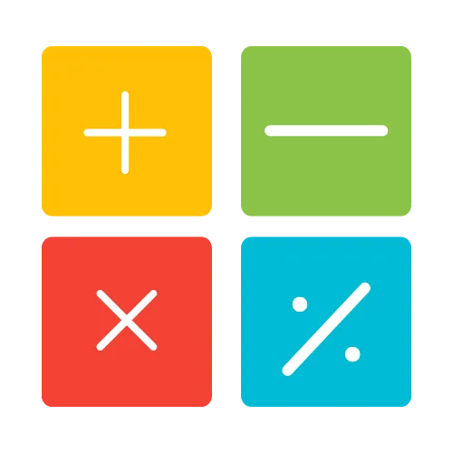

---
tags:
    - Lineær Algebra
    - Vektorer
    - Matricer
    - Vektorregning
    - Linearkombination
    - Udspænding (Span)
    - Matrixligninger
    - Løsningsmængder
    - Parametrisk Vektorform
    - Lineær Uafhængighed
---

<h1 align="center">Vektorer og matricer</h1>

I denne session udvider vi vores værktøjskasse fra lineære ligningssystemer til at omfatte vektorer og matricer, som er centrale for at modellere og løse problemer inden for alt fra fysik og computergrafik til dataanalyse. Vi starter med at definere vektorer i $\mathbb{R}^n$, deres grundlæggende operationer som addition og skalarmultiplikation, og vi udforsker den geometriske intuition bag disse, herunder parallelogramloven. Vi introducerer begreberne lineære kombinationer og udspænding (span) for at forstå, hvilket rum en samling af vektorer kan generere.

Sessionen forbinder disse nye koncepter til det, vi allerede har lært, ved at introducere matrixligningen $A \vec{x} = \vec{b}$. Vi viser, hvordan denne kompakte form er ækvivalent med både vektorligninger og lineære ligningssystemer, hvilket giver en dybere forståelse af løsningsstrukturer. Vi undersøger løsningsmængder for både homogene og inhomogene systemer og lærer at beskrive dem præcist ved hjælp af parametrisk vektorform. Endelig introducerer vi det fundamentale begreb lineær uafhængighed for at kunne afgøre, om et sæt af vektorer er redundant, eller om hver vektor bidrager unikt til systemet.

- {align=right : style="height:100px;width:150px"}
    
    **M1:** Her finder du læsemateriale, videoer og quizzer, der hjælper dig med at forberede dig til den første undervisning. Det er vigtigt at man som minimum har set videoerne.

    [:octicons-arrow-right-24: M1: Forberedelse](M1.md)

- {align=right : style="height:100px;width:150px"}

    **M2:** Her finder du de eksempler som jeg gennemgår til den første undervisningsgang og efterfølgende lægger jeg videoen op her også. Det er vigtigt at I har set videoerne fra M1 inden.
    
    [:octicons-arrow-right-24: M2: Undervisning 1](M2.md)

- {align=right : style="height:150px;width:150px"}

    **M3:** Her finder du de øvelser, som I skal lave enten selv eller i grupper. Der er også en række tutorials, der viser hvordan man kan gribe opgaverne an.

    [:octicons-arrow-right-24: M3: Øvelser](M3/index.md)

- {align=right : style="height:100px;width:150px"}

    **M4:** Her finder du materiale fra anden undervisnings-gang, herunder mine løsninger, og efterfølgende lægger jeg videoen op her også.
    
    [:octicons-arrow-right-24: M4: Undervisning 2](M4.md)

